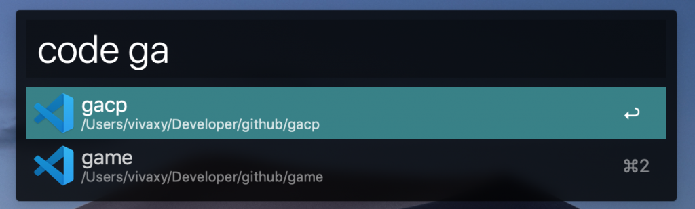

# Alfred Open in VSCode

[![NPM Version][npm-version-image]][npm-url]
[![NPM Downloads][npm-downloads-image]][npm-url]
[![GPL License][license-image]][license-url]
[![Standard Version][standard-version-image]][standard-version-url]

Alfred 4 workflow to open in VSCode.

## Feature

- Search projects and open in VSCode.
- Search projects and reveal in Finder.
- Open selected file in VSCode.
- Fuzzy search.

## Installation

- `npm i -g alfred-open-in-vscode`.
- Configure workflow, set `Project directories` to the glob pattern to match your project directories. e.g. `/Users/vivaxy/Developer/*/*`. This will find projects like `/Users/vivaxy/Developer/github/alfred-open-in-vscode` and `/Users/vivaxy/Developer/gitlab/alfred-open-in-webstorm`.

## Usage

- Type `code` with a space to search. Press `enter` to open selected project in VSCode. Hold `command` and press `enter` to reveal in Finder.
- Select a file in Finder, type `code` (without space) and press `enter` to open this folder in VSCode.

## Troubleshooting

- Type `code DEBUG` to show the debug info.

## Related

- [shaodahong/alfred-code](https://github.com/shaodahong/alfred-code) - Find projects from VSCode application cache.
- [Alfy](https://github.com/sindresorhus/alfy) - This workflow is based on Alfy.
- [Alfred Open in WebStorm](https://github.com/vivaxy/alfred-open-in-webstorm) - Same workflow for WebStorm.
- [Alfred 4 Workflow Open in VSCode](https://vivaxyblog.github.io/2019/08/14/alfred-workflow-open-in-vscode.html) - Related article.

[npm-version-image]: https://img.shields.io/npm/v/alfred-open-in-vscode.svg?style=flat-square
[npm-url]: https://www.npmjs.com/package/alfred-open-in-vscode
[npm-downloads-image]: https://img.shields.io/npm/dt/alfred-open-in-vscode.svg?style=flat-square
[license-image]: https://img.shields.io/npm/l/alfred-open-in-vscode.svg?style=flat-square
[license-url]: LICENSE
[standard-version-image]: https://img.shields.io/badge/release-standard%20version-brightgreen.svg?style=flat-square
[standard-version-url]: https://github.com/conventional-changelog/standard-version
